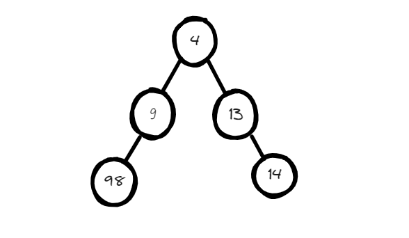

## 102.二叉树的层序遍历

```c++
class Solution {
public:
    vector<vector<int>> result;

    // 获取二叉树的高度
    int getHeight(TreeNode* root) {
        if (root == nullptr) return 0;
        return max(getHeight(root->left), getHeight(root->right)) + 1;
    }

    void hiertraversal(TreeNode* root, int level, vector<int>& temp) {
        if (root == nullptr) return;
        if (level == 1) { // 到达遍历层
            temp.push_back(root->val);
        } else {
            hiertraversal(root->left, level - 1, temp);
            hiertraversal(root->right, level - 1, temp);
        }
    }

    vector<vector<int>> levelOrder(TreeNode* root) {
        int height = getHeight(root);
        for (int i = 1; i <= height; i++) {
            vector<int> temp;
            hiertraversal(root, i, temp);
            result.push_back(temp);
        }
        return result;
    }
};
```

层序遍历需要先获取树的高度，这样好让我们去到想要的层数

本人的思想是：以获取的高度为for循环的遍历次数，每次代表去所在的层数收集所有元素，把收集到的元素保存到temp容器中，再把temp的结果保存到全局的result中，遍历结束后返回result即可

老师的代码只是更加简洁 ，思路并无不同

```c++
class Solution {
public:
    void order(TreeNode* cur, vector<vector<int>>& result, int depth)
    {
        if (cur == nullptr) return;
        if (result.size() == depth) result.push_back(vector<int>());
        result[depth].push_back(cur->val);
        order(cur->left, result, depth + 1);
        order(cur->right, result, depth + 1);
    }
    vector<vector<int>> levelOrder(TreeNode* root) {
        vector<vector<int>> result;
        int depth = 0;
        order(root, result, depth);
        return result;
    }
};
```

## 226.翻转二叉树

### 递归版

```c++
class Solution {
public:
    TreeNode* invertTree(TreeNode* root) {
        if (root == nullptr) return nullptr;

        // 保存左子树
        TreeNode* left = root->left;

        // 将右子树的翻转结果赋值给左子树
        root->left = invertTree(root->right);

        // 将保存的左子树赋值给右子树
        root->right = invertTree(left);

        return root;
    }
};
```

最开始的错误代码如下：

```c++
class Solution {
public:

    TreeNode* invertTree(TreeNode* root) {
        if(root == nullptr) return nullptr;
        root->left = invertTree(root->right);
        root->right = invertTree(root->left);
        return root;
    }
};
```

分析错误代码的错误原因


上图是最初的状态，我们看看不提前保存左子树的照成的问题

我们先执行的代码`root->left = invertTree(root->right)`


原来没有被保存的左子树被覆盖了

那我们可以考虑提前把左右子树的地址进行交换，再去处理

```c++
class Solution {
public:

    TreeNode* invertTree(TreeNode* root) {
        if(root == nullptr) return nullptr;
        swap(root->left,root->right);
        invertTree(root->right);
        invertTree(root->left);
        return root;
    }
};
```

### 非递归版


## 101. 对称二叉树

### 递归版

```c++
class Solution {
public:

    bool func(TreeNode* leftNode, TreeNode* rightNode){     //传入的两个节点是要比较的两个节点
        if(leftNode == nullptr && rightNode != nullptr) return false;
        else if(leftNode != nullptr && rightNode == nullptr) return false;
        else if(leftNode == nullptr && rightNode == nullptr) return true;	//特别注意
        else if(leftNode->val != rightNode->val) return false;

        //已经排除不对称的所有情况
        return func(leftNode->right,rightNode->left) && func(leftNode->left,rightNode->right);
    }

    bool isSymmetric(TreeNode* root) {
        if(root == nullptr) return true;
        return func(root->left,root->right);
    }
};
```

特别注意，比较是否对称的两个节点为空，是对称的，判断结果应当返回true

### 非递归版


## 104.二叉树的最大深度

### 递归版

```c++
class Solution {
public:
    int maxDepth(TreeNode* root) {
        //求二叉树的最大深度，就等价于求二叉树的最大高度
        if(root == nullptr) return 0;
        return max(maxDepth(root->left),maxDepth(root->right)) + 1;
    }
};
```

你是否觉得这份代码相当熟悉，早就见过面了

### 非递归版


## 111.二叉树的最小深度

### 递归版

```c++
class Solution {
public:
    int depth = INT32_MAX;
    void getminDepth(TreeNode* root,int level){
        if(root == nullptr) return;
        if(root->left == nullptr && root->right == nullptr){ //到达叶子节点
            depth = min(depth,level);
            return;
        }
        //遍历左子树
        getminDepth(root->left,level + 1);
        //遍历右子树
        getminDepth(root->right,level + 1);
        return;
    }
    int minDepth(TreeNode* root) {
        //遍历方式: 从上到下，前序遍历
        if(root == nullptr) return 0;
        int level = 1;
        getminDepth(root,level);
        return depth;
    }
};
```

最开始没有想到，直接往后走把会的拿下

回过头来看，既然是要求最小深度，我们把二叉树想的朴素一点，就像下图



以根节点为观察点，就是看根节点左边的长度和右边的长度谁最短

至此传入节点并进行递归重复如上操作，以到达叶子节点为结束，同时进行比较，获取最小深度

二叉树和递归联系相当之深，而递归容易把人弄晕，因此学会把重复的操作简化出来

### 非递归版


## 222.完全二叉树的节点个数

### 递归版

```c++
class Solution {
public:
    int num = 0;

    int getHeight(TreeNode* root){
        if(root == nullptr) return 0;
        return max(getHeight(root->left),getHeight(root->right)) + 1;
    }

    int func(TreeNode* root,int height){	//收集最后一层节点数
        if(root == nullptr) return 0;
        if(height == 1){    //到达最后一层
            num++;
        }
        func(root->left,height-1);
        func(root->right,height-1);
        return num;
    }
    
    int countNodes(TreeNode* root) {
        if(root == nullptr) return 0;
        int height = getHeight(root);
        if(height == 1) return 1;
        int count = pow(2,height-1) - 1;	//除最后一层以外所有的节点数
        num = count + func(root,height);
        return num;
    }
};
```

我的思路：

1. 采用层序遍历到达到达最后一层收集节点数
2. 利用公式取的除最后一层以外所有的节点数（利用完全二叉树的特性）
3. 将两个结果加起来返回即可

### 非递归版


##  **110.平衡二叉树**

### 递归版

```c++
class Solution {
public:
    int result = 0;

    int getHeight(TreeNode* root){
        if(root == nullptr) return 0;
        return max(getHeight(root->left),getHeight(root->right)) + 1;
    }

    bool isBalanced(TreeNode* root) {
        if(root == nullptr) return true;
        //求每个节点对应的左右子树高度，然后求平衡差
        int h1 = getHeight(root->left);
        int h2 = getHeight(root->right);

        if(abs(h1-h2) > 1) return false;

        return isBalanced(root->left) && isBalanced(root->right);
    }
};
```

这道题如果看到代码并不难理解，你把整个过程想得简单点

题意：一个二叉树每个节点的左右两个子树的高度差的绝对值不超过 1

即求得当前节点的两棵子树的高度，高度差的绝对值不超过 1（如此反复即可）

### 非递归版


## 257. 二叉树的所有路径

### 递归版

```c++
 //明显有回溯的意思

class Solution {
public:
    void back(TreeNode* node,vector<string>& path,string result){
        result +=to_string(node->val);
        if(node->left == nullptr && node->right == nullptr){    //收集路径
            path.push_back(result);
            return;
        }
        result +="->";
        if(node->left != nullptr && node->right != nullptr){
            back(node->left,path,result);
            back(node->right,path,result);
        }else if(node->left != nullptr && node->right == nullptr){
            back(node->left,path,result);
        }else if(node->left == nullptr && node->right != nullptr){
            back(node->right,path,result);
        }
    }

    vector<string> binaryTreePaths(TreeNode* root) {
        vector<string> path;
        string result = "";
        back(root,path,result);
        return path;
    }
};
```

如上代码的分类讨论的写法当然好理解，明显也可以被优化，老师的代码就是如此

```c++
class Solution {
private:

    void traversal(TreeNode* cur, string path, vector<string>& result) {
        path += to_string(cur->val); // 中
        if (cur->left == NULL && cur->right == NULL) {
            result.push_back(path);
            return;
        }
        if (cur->left) traversal(cur->left, path + "->", result); // 左
        if (cur->right) traversal(cur->right, path + "->", result); // 右
    }

public:
    vector<string> binaryTreePaths(TreeNode* root) {
        vector<string> result;
        string path;
        if (root == NULL) return result;
        traversal(root, path, result);
        return result;

    }
};
```

### 非递归版


## 404.左叶子之和

### 递归版

```c++
class Solution {
public:
    void func(TreeNode* node,int &result){
        if(node->left == nullptr && node->right == nullptr) return;
        if(node->left != nullptr && node->left->left == nullptr && node->left->right == nullptr){
            //收集左叶子
            result += node->left->val;
        }
        if(node->left != nullptr) func(node->left,result);
        if(node->right != nullptr) func(node->right,result);
    }
    int sumOfLeftLeaves(TreeNode* root) {
        int result = 0;
        func(root,result);
        return result;
    }
};
```

这个地方就巧妙的把前个题目简化的方法给用起来了，即如下代码

```c++
if(node->left != nullptr) func(node->left,result);
if(node->right != nullptr) func(node->right,result);
```

### 非递归版


## 513.找树左下角的值

### 递归版

```c++
class Solution {
public:
    int result = 0;
    int getHeight(TreeNode* root){
        if(root == nullptr) return 0;
        return max(getHeight(root->left),getHeight(root->right)) + 1;
    }

    void func(TreeNode* node,int level){
        if(node == nullptr) return;
        if(level == 1){ //到达最底层
            result = node->val;
            return;
        }
        func(node->right,level-1);
        func(node->left,level-1);
        return;
    }

    int findBottomLeftValue(TreeNode* root) {
        int height = getHeight(root);
        func(root,height);
        return result;
    }
};
```

这道题最搞人的就是中文翻译，非常傻逼！

题目：请找出该二叉树的 **最底层 最左边** 节点的值

但是这个节点也可以为 **最底层 最右边** 的节点

它题目本来的含义是这棵树的最底层从右往左看到的最后一个节点，它必然就是该二叉树的 **最底层 最左边** 节点的值

因此，题目的解法用层次遍历，从右往左的遍历顺序

### 非递归版


## 112. 路径总和

### 递归版

```c++
class Solution {
public:
    void func(TreeNode* root, int targetSum,bool& result,int count){
        if(root == nullptr) return;
        count = count + root->val;
        if(root->right == nullptr && root->left == nullptr){
            if(count == targetSum){
                result = true;
            }
            return;
        }
        func(root->left,targetSum,result,count);
        func(root->right,targetSum,result,count);
        return;
    }

    bool hasPathSum(TreeNode* root, int targetSum) {
        bool result = false;
        int count = 0;
        func(root,targetSum,result,count);
        return result;
    }
};
```


### 非递归版


## 106.从中序与后序遍历序列构造二叉树

### 递归版

```c++
class Solution {
public:

    TreeNode* func(vector<int>& inorder, vector<int>& postorder){
        int midindex = 0;
        int backindex = 0;
        //获取后序数组的最后一个元素，并移除
        if(postorder.size() == 0){
            return nullptr;
        }
        int Midnum = postorder[postorder.size()-1];
        postorder.resize(postorder.size()-1);

        //遍历找到在中序数组中的下标，然后划分中序数组的左右子树
        for(int i = 0; i < inorder.size(); i++){
            if(Midnum == inorder[i]){
                midindex = i;
                break;
            }
        }
        vector<int> leftMidTree(inorder.begin(),inorder.begin()+midindex);
        vector<int> rightMidTree(inorder.begin()+midindex+1,inorder.end());

        TreeNode* root = new TreeNode(inorder[midindex]);   //创建根节点

        //根据得到的中序数组确定后序数组的左右子树
        vector<int> leftBackTree(postorder.begin(),postorder.begin()+leftMidTree.size());
        vector<int> rightBackTree(postorder.begin()+leftMidTree.size(),postorder.end());

        root->left = func(leftMidTree,leftBackTree);
        root->right = func(rightMidTree,rightBackTree);

        return root;

    }

    TreeNode* buildTree(vector<int>& inorder, vector<int>& postorder) {
        return func(inorder,postorder);
    }
};
```

中序遍历（左中右）+ 后序遍历（左右中）确定一颗二叉树的思路：

1. 通过后序数组的最后一个元素，确定当前根节点
2. 利用刚得到根节点在中序数组中查找，确定中序数组的下标，以此下标确定范围，即左子树和右子树
3. 移除后序数组的最后一个元素，因为我们不再需要
4. 接着确定后序数组的范围，这并不难，因为前面我们已经确定中序左数组和中序右数组。所以，能轻松确定后序数组的左子树和后序数组的右子树
5. 创建根节点，将本次递归得到的根节点分别指向`中序左数组与后序左数组`和`中序右数组与后序右数组`

### 非递归版


## 617.合并二叉树

1. ### 递归版


```c++
class Solution {
public:
    TreeNode* func(TreeNode* root1, TreeNode* root2){
        int num = 0;
        if(root1 == nullptr && root2 == nullptr){
            return nullptr;
        }else if(root1 != nullptr && root2 == nullptr){
            return root1;
        }else if(root1 == nullptr && root2 != nullptr){
            return root2;
        }else{
            num = root1->val + root2->val;
        }
        
        TreeNode* root = new TreeNode(num);

        root->left = func(root1->left,root2->left);
        root->right = func(root1->right,root2->right);

        return root;
    }

    TreeNode* mergeTrees(TreeNode* root1, TreeNode* root2) {
        return func(root1,root2);
    }
};
```

在做这道题的时候犯错了，我们把思路梳理一遍：

1. 如果两个树的节点都为空，返回nullptr
2. 如果只有一个树为空，另一个树不为空，返回不为空的树的节点
3. 如果两棵树都不为空，将两个节点对应的值相加并创建节点

我是在第 2 上犯错，陷入错误的思维是对于空的树记为0，不为空的树取值之后与之相加，然后创建节点返回。看似没有问题，但是为空的树已经没有进入下一循环的必要，不可能会合并了，因此要在第二种情况下直接返回节点即可，否则会出现指针错误。

### 非递归版


## **700.二叉搜索树中的搜索** 

### 递归版

```c++
class Solution {
public:
    TreeNode* searchBST(TreeNode* root, int val) {
        if (root == nullptr) {
            return nullptr; // 如果树为空，直接返回nullptr
        }

        if (root->val > val) {
            return searchBST(root->left, val);
        } else if (root->val < val) {
            return searchBST(root->right, val);
        } else {
            return root; // 找到匹配的值，直接返回当前节点
        }
    }
};
```

### 非递归版


## 98.验证二叉搜索树

### 递归版

```c++
class Solution {
public:
    // 中序
    void func(TreeNode* root, long long& num, bool& result) {
        if (root == nullptr || !result) {
            return;
        }

        func(root->left, num, result);

        if (root->val <= num) {
            result = false;
            return;
        }

        num = root->val;

        func(root->right, num, result);
    }

    bool isValidBST(TreeNode* root) {
        // 中序遍历，为递增有序
        long long num = LLONG_MIN;
        bool result = true;
        func(root, num, result);
        return result;
    }
};
```

验证二叉搜索树用中序遍历，递增有序的

老师说的坑应该是传递进去的最小值范围写大点，`int`类型不满足题意，得是`long long`

### 非递归版


## 530.二叉搜索树的最小绝对差 

### 递归版

```c++
class Solution {
public:
    void fun(TreeNode* root,vector<int>& result){
        if(root == nullptr) return;
        fun(root->left,result);
        result.push_back(root->val);
        fun(root->right,result);
        return;
    }
    int getMinimumDifference(TreeNode* root) {
        vector<int> data;
        int result = INT32_MAX;
        fun(root,data);
        for(int i = 1; i < data.size(); i++){
            int num = data[i]-data[i-1];
            if(num < result) result = num;
        }
        return result;
    }
};
```

别想太复杂，思路能走的通，测试用例能过就是好样的

对于老师所说的**在递归遍历的过程中如何记录前后两个指针**，这个技巧还是有必要知道的

```c++
#include <climits>

class Solution {
private:
    // 用于记录最小差值
    int minDiff = INT_MAX;
    // 用于记录当前节点的前一个节点
    TreeNode* prev = nullptr;

public:
    // 中序遍历
    void inOrderTraversal(TreeNode* root) {
        if (root == nullptr) {
            return;
        }

        // 遍历左子树
        inOrderTraversal(root->left);

        // 计算相邻两个节点值之间的差值
        if (prev != nullptr) {
            minDiff = min(minDiff, root->val - prev->val);
        }

        // 由于马上进入下一个节点，prev实际作用是记录前一个节点，也就是当前的节点
        prev = root;

        // 遍历右子树
        inOrderTraversal(root->right);
    }

    // 计算二叉搜索树中相邻节点值的最小差值
    int getMinimumDifference(TreeNode* root) {
        // 调用中序遍历
        inOrderTraversal(root);

        // 返回最小差值
        return minDiff;
    }
};
```

### 非递归版


## 501.二叉搜索树中的众数 

### 递归版

```c++
class Solution {
private:
    int maxCount = 0; // 最大频率
    int count = 0; // 统计频率
    TreeNode* pre = NULL;
    vector<int> result;
    void searchBST(TreeNode* cur) {
        if (cur == NULL) return ;

        searchBST(cur->left);       // 左
                                    // 中
        if (pre == NULL) { // 第一个节点
            count = 1;
        } else if (pre->val == cur->val) { // 与前一个节点数值相同
            count++;
        } else { // 与前一个节点数值不同
            count = 1;
        }
        pre = cur; // 更新上一个节点

        if (count == maxCount) { // 如果和最大值相同，放进result中
            result.push_back(cur->val);
        }

        if (count > maxCount) { // 如果计数大于最大值频率
            maxCount = count;   // 更新最大频率
            result.clear();     // 很关键的一步，不要忘记清空result，之前result里的元素都失效了
            result.push_back(cur->val);
        }

        searchBST(cur->right);      // 右
        return ;
    }

public:
    vector<int> findMode(TreeNode* root) {
        count = 0;
        maxCount = 0;
        pre = NULL; // 记录前一个节点
        result.clear();

        searchBST(root);
        return result;
    }
};
```

既然已经通过pre = cur获取前一个节点的值，因此前一个元素就直接能够获取，无需刻意存储

对于相同次数的值先存储起来，如果有更大的次数的值，就把之前的全部清空，存储当前值

### 非递归版


## 236.二叉树的最近公共祖先 

### 递归版

```c++
class Solution {
public:
    // 寻找二叉树中两个节点的最低公共祖先
    TreeNode* lowestCommonAncestor(TreeNode* root, TreeNode* p, TreeNode* q) {
        // 如果根节点为空，或者当前节点是p或q，则返回当前节点
        if (root == q || root == p || root == NULL) 
            return root;

        // 递归在左子树中寻找最低公共祖先
        TreeNode* left = lowestCommonAncestor(root->left, p, q);
        // 递归在右子树中寻找最低公共祖先
        TreeNode* right = lowestCommonAncestor(root->right, p, q);

        // 如果左右子树分别包含p和q，则当前节点即为最低公共祖先
        if (left != NULL && right != NULL) 
            return root;

        // 如果只有右子树包含p或q，则返回右子树的结果
        if (left == NULL && right != NULL) 
            return right;
        // 如果只有左子树包含p或q，则返回左子树的结果
        else if (left != NULL && right == NULL) 
            return left;
        // 如果左右子树均不包含p和q，则返回空值
        else  
            return NULL;
    }
};
```

这道题确实抽象，至少我们可以肯定这是回溯的思想，因此遍历方式为后序遍历

1. 从上往下处理--->前序遍历
2. 从下往上处理--->后序遍历

后面的处理代码实际上就是在把找到的节点往会推送

```c++
// 如果只有右子树包含p或q，则返回右子树的结果
if (left == NULL && right != NULL) 
         return right;
// 如果只有左子树包含p或q，则返回左子树的结果
else if (left != NULL && right == NULL) 
         return left;
// 如果左右子树均不包含p和q，则返回空值
else  
         return NULL;
```

直到遇到他们的共同祖先

```c++
// 如果左右子树分别包含p和q，则当前节点即为最低公共祖先
if (left != NULL && right != NULL) 
       return root;
```

### 非递归版


## 235. 二叉搜索树的最近公共祖先 

### 递归版

```c++
class Solution {
private:
    TreeNode* traversal(TreeNode* cur, TreeNode* p, TreeNode* q) {
        if (cur == NULL) return cur;
                                                        // 中
        if (cur->val > p->val && cur->val > q->val) {   // 左
            TreeNode* left = traversal(cur->left, p, q);
            if (left != NULL) {
                return left;
            }
        }

        if (cur->val < p->val && cur->val < q->val) {   // 右
            TreeNode* right = traversal(cur->right, p, q);
            if (right != NULL) {
                return right;
            }
        }
        return cur;
    }
public:
    TreeNode* lowestCommonAncestor(TreeNode* root, TreeNode* p, TreeNode* q) {
        return traversal(root, p, q);
    }
};
```

想着利用二叉搜索树的有序性，始终没有如意

我想是没有弄清楚在这个寻找最近公共祖先在二叉搜索树中的特点：

如果被查询的两个节点**都在**左子树或右子树，进入其中找到最近祖先

最近祖先会是哪个呢？直到从当前节点看被查询的两个节点各自分配在不同的子树（图中的34节点）


如果被查询的两个节点**分别**在左子树或右子树，那么当前节点就是最近祖先（图中的45节点）


### 非递归版

## 701.二叉搜索树中的插入操作 

### 递归版

```c++
class Solution {
public:

    TreeNode* insertIntoBST(TreeNode* root, int val) {
        if(root == nullptr){
            TreeNode* node = new TreeNode(val);
            return node;
        } 
        if(root->val > val){
            root->left = insertIntoBST(root->left,val);
        }else if(root->val < val){
            root->right = insertIntoBST(root->right,val);
        }
        return root;
    }
};
```

无论写多少次，还是不够熟练

函数的不断调用真的反人类！

### 非递归版

## 450.删除二叉搜索树中的节点 

### 递归版

```c++
class Solution {
public:

    TreeNode* getNode(TreeNode* node){
        if(node == nullptr) return nullptr;
        TreeNode* root =node;
        while(root->left){
            root = root->left;
        }
        return root;
    }

    TreeNode* deleteNode(TreeNode* root, int key) {
        if(root == nullptr) return nullptr;
        //遍历左右子树，找到待删除节点
        root->left = deleteNode(root->left,key);
        root->right = deleteNode(root->right,key);
        if(root->val == key){    //满足删除条件
            //待删除节点为叶子节点
            if(root->left == nullptr && root->right == nullptr){
                return nullptr;
            }
            //待删除节点存在左子树
            else if(root->left != nullptr && root->right == nullptr){
                TreeNode* node = root->left;
                return node;
            }
            //待删除节点存在右子树
            else if(root->left == nullptr && root->right != nullptr){
                TreeNode* node = root->right;
                return node;
            }
            //待删除节点存在左右子树
            //寻找待删除节点右子树最左孩子进行替换
            else{
                TreeNode* node = getNode(root->right);
                root->val = node->val;
                root->right = deleteNode(root->right,node->val);    //递归地删除替换的结点（非常关键的一步）
                return root;
            }
        }
        return root;
    }
};
```

最核心的就是`待删除节点存在左右子树`的处理


### 非递归版


## 669. 修剪二叉搜索树 

### 递归版

```c++
class Solution {
public:

    TreeNode* getNode(TreeNode* node){
        if(node == nullptr) return nullptr;
        TreeNode* root =node;
        while(root->left){
            root = root->left;
        }
        return root;
    }

    TreeNode* trimBST(TreeNode* root, int low, int high) {
        if(root == nullptr) return nullptr;
        root->left = trimBST(root->left,low,high);
        root->right = trimBST(root->right,low,high);
        if(root->val < low || root->val > high){    //满足删除条件
            //待删除节点为叶子节点
            if(root->left == nullptr && root->right == nullptr){
                return nullptr;
            }
            //待删除节点存在左子树
            else if(root->left != nullptr && root->right == nullptr){
                TreeNode* node = root->left;
                return node;
            }
            //待删除节点存在右子树
            else if(root->left == nullptr && root->right != nullptr){
                TreeNode* node = root->right;
                return node;
            }
            //待删除节点存在左右子树
            //寻找待删除节点右子树最左孩子进行替换
            else{
                TreeNode* node = getNode(root->right);
                root->val = node->val;
                root->right = trimBST(root->right,low,high);
                return root;
            }
        }
        return root;
    }
};
```

相比于删除二叉搜索树中的节点，这里只需要修改查询待删除节点的条件即可

我最初的450题目并没有把递归的代码写在最前面，而是放在最后面的。但是我在读到本题的时候，我觉得就是把450题目中的条件修改为范围而已，结果当我拿过来的时候却无法通过。看别人的代码发现其余逻辑完全相同，只是递归的代码选择放在前面，为了综合二者，我选择把递归的代码放在前面了

### 非递归版


## 108.将有序数组转换为二叉搜索树 

### 递归版

```c++
class Solution {
public:
    TreeNode* sortedArrayToBST(vector<int>& nums) {
        if(nums.size() == 0) return nullptr;
        //找到根元素，数组的中间位置，数组长度为奇数和偶数并没有区别
        int index = nums.size() / 2;
        int mid = nums[index];
        TreeNode* root = new TreeNode(mid);
        //分割左右子树
        vector<int> leftNum(nums.begin(),nums.begin() + index);
        vector<int> rightNum(nums.begin() + index + 1,nums.end());
        //构建二叉树（递归）
        root->left = sortedArrayToBST(leftNum);
        root->right = sortedArrayToBST(rightNum);
        return root;
    }
};
```

### 非递归版


## 538.把二叉搜索树转换为累加树 

### 递归版

```c++
class Solution {
private:
    int pre = 0; // 记录前一个节点的数值
    void traversal(TreeNode* cur) { // 右中左遍历
        if (cur == NULL) return;
        traversal(cur->right);
        cur->val += pre;
        pre = cur->val;
        traversal(cur->left);
    }
public:
    TreeNode* convertBST(TreeNode* root) {
        pre = 0;
        traversal(root);
        return root;
    }
};
```

反中序遍历

### 非递归版
