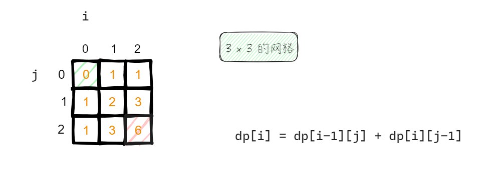
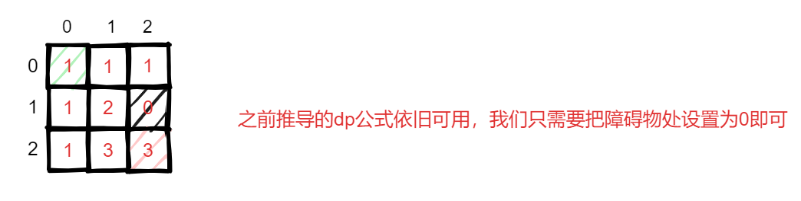

## 509. 斐波那契数

```c++
class Solution {
public:
    int fib(int n) {
        if(n == 0) return 0;
        if(n == 1) return 1;
        vector<int> result(n+1);
        result[0] = 0;
        result[1] = 1;
        for(int i = 2; i <= n; i++){
            result[i] = result[i - 1] + result[i-2];
        }
        int num = result[n];
        return num;
    }
};
```

代码可以考虑简化一下：

```c++
class Solution {
public:
    int fib(int n) {
        if(n <= 1) return n;
        vector<int> result(n+1);
        result[0] = 0;
        result[1] = 1;
        for(int i = 2; i <= n; i++){
            result[i] = result[i - 1] + result[i-2];
        }
        return result[n];
    }
};
```

## 70. 爬楼梯

```c++
class Solution {
public:
    int climbStairs(int n) {
        // 每次可以走 1 或 2
        // n 代表楼梯数
        if(n <= 2) return n;
        vector<int> result(n+1);
        result[1] = 1;
        result[2] = 2;
        for(int i = 3; i <= n; i++){
            result[i] = result[i-1] + result[i-2];
        }
        return result[n]; 
    }
};
```

如果光去思考这道题的话会不好理解，如果按照顺序罗列出每层阶梯从头开始可用的走法数量，你就会发现这就是个斐波那契数，也就轻松写出代码了

## 746. 使用最小花费爬楼梯

关键词`最小花费`，从前面那道题基础上开始涉及最值问题，难度也在不断上升

已经不再是简单的写个公式就能得出答案的，还要涉及合理的选择

```c++
//一旦你支付此费用，即可选择向上爬一个或者两个台阶

class Solution {
public:
    int minCostClimbingStairs(vector<int>& cost) {
        int count = 0;
        vector<int> dp(cost.size());
        dp[0] = cost[0];
        dp[1] = cost[1];
        for(int i = 2; i < cost.size(); i++){
            dp[i] = min(dp[i-1],dp[i-2]) + cost[i];
        }
        int len = dp.size() - 1;
        int result = min(dp[len],dp[len-1]);
        return result;
    }
};
```

关于这道题我的想法，dp[i]数组前两个位置和cost[i]数组中的值保持相同（题目保证cost数组至少存在两个元素）

这样为后面的dp[i]对象提供参考值，实际上这句话暗含的意思是当前dp[i]对象（i >= 3）的取值依赖于前两个数值的情况。题目说要取最小花费，公式不难写出：` dp[i] = min(dp[i-1],dp[i-2]) + cost[i];`

只不过这还不算完，因为楼梯的跨度可为1或2，这就可能出现提前走完楼梯然后避免再多花费的情形，比方说样例中的第一组数据`cost = [10,15,20]`

因此，最后的取值是把dp数组中最后两个元素比较获取最小值返回即可

网上大部分的写法，当然就是下面这种

```c++
class Solution {
public:
    int minCostClimbingStairs(vector<int>& cost) {
        vector<int> dp(cost.size() + 1);
        dp[0] = 0; // 默认第一步都是不花费体力的
        dp[1] = 0;
        for (int i = 2; i <= cost.size(); i++) {
            dp[i] = min(dp[i - 1] + cost[i - 1], dp[i - 2] + cost[i - 2]);
        }
        return dp[cost.size()];
    }
};
```

## 62.不同路径 

前面的题目都是一维，直到这里我们开始涉及二维，难度可以说又提高了，后面还会涉及二维求最值的情况，难度再度提高

对于二维数组的话，个人建议画图来得出规律，这样就会容易写出dp公式，问题难度减半

```c++
class Solution {
public:
    int uniquePaths(int m, int n) {
        vector<vector<int>> dp(m,vector<int>(n,1)); 
        for(int i = 1; i < m; i++){
            for(int j = 1; j < n; j++){
                dp[i][j] = dp[i-1][j] + dp[i][j-1];
            }
        }
        return dp[m-1][n-1];
    }
};
```

我们先画图：



我们在开始推导前，有哪些已经被确定？第一行和第一列的数值是可以确定

从后面的dp公式可以直到，第一行第一列的值无关紧要，因为根本用不到它，为了方便初始化，我们直接初始化为1即可，反正后面有效值会被覆盖

```c++
vector<vector<int>> dp(m,vector<int>(n,1));
```

我们通过画图找到的规律就是，当前的值等于左边的第一个值和上边的第一个值之和

```c++
dp[i][j] = dp[i-1][j] + dp[i][j-1];
```

## 63. 不同路径 II （坑）

这道题增加的难度是设置障碍物，而且容易掉进坑里

```C++
class Solution {
public:
    int uniquePathsWithObstacles(vector<vector<int>>& obstacleGrid) {
        //网格中有障碍物(数量不确定)
        int m = obstacleGrid.size();    //行
        int n = obstacleGrid[0].size(); //列
        vector<vector<int>> dp(m,vector<int>(n,0));
        //先把第一行和第一列进行处理，只要出现障碍物，其障碍物之和的全为0
        int num = 1;
        for(int i = 0; i < n; i++){ //处理列
            if(obstacleGrid[0][i] == 1){
                num = 0;    //后面的全部赋值为0
            }
            dp[0][i] = num;
        }
        num = 1;
        for(int i = 0; i < m; i++){ //处理行
            if(obstacleGrid[i][0] == 1){
                num = 0;    //后面的全部赋值为0
            }
            dp[i][0] = num;
        }

        for(int i = 1; i < m; i++){
            for(int j = 1; j < n; j++){
                if(obstacleGrid[i][j] == 1){
                    dp[i][j] == 0;
                    continue;
                }
                dp[i][j] = dp[i-1][j] + dp[i][j-1];
            }
        }

        return dp[m-1][n-1];
    }
};
```



有障碍物意味着不能过，那它对后面的影响就是无法提供路径，因此设置为0即可

**但是这种思考是存在缺陷的**，因此我们需要提前对特殊的行和列进行处理，即第一行和第一列的处理

只要出现障碍物，第一行的障碍物以后全为0，第一列的障碍物以下全为0

做好这个工作之后，由于障碍物的数量是不确定的，因此我们需要遍历整个数组找到障碍物并设置为0，代表此路不通。既然我们最后还是要遍历数组进行dp运算，也就可以把这个dp的操作在前面遍历整个数组寻找障碍物的时候一并完成，最后得出结果

还有一点，我们这次整个数组的初始化为0，因为我们要对第一行和第一列进行特殊处理，再设置为1的话不适合判断

## 343. 整数拆分 （直接看题解）

```c++
class Solution {
public:
    int integerBreak(int n) {
        vector<int> dp(n + 1);
        dp[2] = 1;
        for (int i = 3; i <= n ; i++) {
            for (int j = 1; j <= i / 2; j++) {
                dp[i] = max(dp[i], max((i - j) * j, dp[i - j] * j));
            }
        }
        return dp[n];
    }
};
```


## 96.不同的二叉搜索树  （直接看题解）

```c++
class Solution {
public:
    int numTrees(int n) {
        vector<int> dp(n + 1);
        dp[0] = 1;
        for (int i = 1; i <= n; i++) {
            for (int j = 1; j <= i; j++) {
                dp[i] += dp[j - 1] * dp[i - j];
            }
        }
        return dp[n];
    }
};
```

这道题和图中数字没有任何关系，我们这里的N = 3，代表有 3 个节点

首先 必然需要拿出 1 个节点作为根节点开始（确定不变的节点），因此还剩下 2 个节点可分配

存在的可能有：

1. 左子树 2 个节点，右子树为 0 个节点
2. 左子树 1 个节点，右子树为 1 个节点
3. 左子树 0 个节点，右子树为 2 个节点

由于之前我们已经计算出dp[2]、dp[1]、dp[0]，这里就能直接利用起来了

一般网上分析到这点之后就会选择停止，按理讲也没问题，但我想继续深究一下

当我们拿到节点数的时候（比方说这里的N = 3），我们必然会选择用1个节点作为根节点，其余 2 个节点拿去分配。因此 1 个节点已经被确定，2  个节点没有被确定，多样性就体现在可分配的 2个节点上，按照不同的分配来形成不同的二叉搜索树

可是，不确定只有变成确定才能得出我们想要的结果

我们要把不确定变成确定，所以才会在上面进行各种可能的讨论，这种抽象的讨论下已经逐渐开始具体，尽管这里面还存在多样性，可你会发现这种多样性已经如泡影，在dp中早已有实际的记录（确定性），直接取出来用即可

我简单举例：左子树 2 个节点，右子树为 0 个节点

这是前面分类讨论中的一种情况，对于 0 个节点没有讨论价值，对于 2 个节点就有的说

对于左子树的2 个节点，拿出 1 个节点作为 根节点，剩余 1 个节点带来多样性（不确定），明眼人都知道这里能够制造两种可能，因此对于这棵左子树有 2 种形态（确定）

这就是从不确定到确定的过程，由于dp中记录着之前不确定的具体结果，拿过来用就可以了


## 416.分割等和子集 