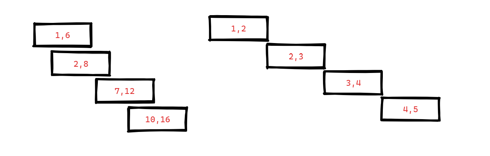
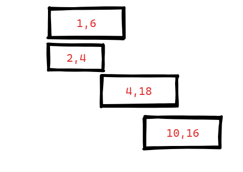
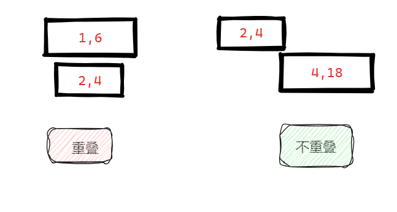

## 455.分发饼干 

```c++
/*
/   s[j] >= g[i]
/   每个孩子最多只能给一块饼干
/   尽可能满足越多数量的孩子，并输出这个最大数值(被满足的孩子数量)
*/

class Solution {
public:
    int findContentChildren(vector<int>& g, vector<int>& s) {
        sort(g.begin(),g.end(),greater<int>());
        sort(s.begin(),s.end(),greater<int>());
        int count = 0;
        int sindex = 0;
        for(int i = 0; i < g.size(); i++){  //胃口
            for(int j = sindex; j < s.size(); j++){ //饼干
                if(s[j] >= g[i]){    //饼干满足胃口
                    count++;
                    sindex++;
                }
                break;	
            }
        }
        
        return count;
    }
};
```

## 376. 摆动序列 

```c++
//创建bool类型 judge ; true代表下次之差要为正数; false 代表下次之差要为负数

class Solution {
public:
    int wiggleMaxLength(vector<int>& nums) {
        if(nums.size() == 1) return 1;
        int index = 0;
        int count = 1;
        for(index; index < nums.size() - 1; index++){
            if(nums[index+1] != nums[index]) break;
        }
        if(index + 1 == nums.size()) return count;
        bool judge = false;
        if(nums[index+1] - nums[index] < 0){    //负数
            judge = true;
        }
        count = 2;
        index++;
        for(index; index < nums.size() - 1; index++){
            int num = nums[index+1] - nums[index];
            if(num > 0 && judge == true){
                count++;
                judge = false;
            }else if(num < 0 && judge == false){
                count++;
                judge = true;
            }else{  //不满足摆动序列，看下一组
                continue;
            }
        }
        return count;
    }
};
```

需要提前处理最开始的重复数值，好让judge变量落实下来

如果全部都是重复值的话，直接返回count即可，也无需judge辅助我们了

## 53. 最大子序和 

```c++
//连续
//最大
class Solution {
public:
    int maxSubArray(vector<int>& nums) {
        int index = 0;
        for(index; index < nums.size(); index++){
            if(nums[index] < 0) continue;
            break;
        }
        if(index == nums.size()){  //没有一个正数
            sort(nums.begin(),nums.end(),greater<int>());
            return nums[0];
        }
        int result = 0; //返回最终结果
        int count = 0;  //当前总和
        for(index; index < nums.size(); index++){
            if(count + nums[index] >= result){
                result = count + nums[index];
            }
            if(count + nums[index] <= 0){
                count = 0;
                continue;
            }
            count = count + nums[index];
        }

        return result;
    }
};
```

## 122.买卖股票的最佳时机II 

```c++
class Solution {
public:
    int maxProfit(vector<int>& prices) {
        int result = 0;
        for(int index = 0; index < prices.size() - 1; index++){
            int num = prices[index + 1] - prices[index];
            if(num > 0) result += num;
        }
        return result;
    }
};
```

## 55. 跳跃游戏 

```c++
class Solution {
public:
    bool canJump(vector<int>& nums) {
        int n = nums.size();
        int maxReach = 0;

        for (int i = 0; i < n; i++) {
            if (i > maxReach) {
                // 无法到达当前位置
                return false;
            }
            
            maxReach = max(maxReach, i + nums[i]);

            if (maxReach >= n - 1) {
                // 已经能够到达末尾
                return true;
            }
        }

        return false;
    }
};

```

我的代码比较复杂，没有上面的简洁，但是思路时相当清晰的

```c++
class Solution {
public:
    bool canJump(vector<int>& nums) {
        if(nums.size() == 1 && nums[0] == 0) return true;	//特殊测试用例处理
        int i = 0;
        while (i < nums.size()) {
            if (nums[i] == 0) return false;	//如果能走的步数为 0，返回false
            if (nums[i] + i >= nums.size() - 1) {	//如果能走的步数大于等于后面需要走的长度，返回true
                return true;
            } else {
                // 选取范围内数字的最大值及对应索引
                int maxIndex = i + 1;
                int maxValue = INT_MIN;
                for (int j = i + 1; j <= i + nums[i] && j < nums.size(); j++) {
                    if (nums[j] + j > maxValue) {
                        maxValue = nums[j] + j;
                        maxIndex = j;
                    }
                }
                i = maxIndex;
            }
        }
        return false;
    }
};
```

## 45.跳跃游戏II 

```c++
class Solution {
public:
    int jump(vector<int>& nums) {
        if(nums.size() == 1 && nums[0] == 0) return 0;
        if(nums.size() == 1 && nums[0] == 1) return 0;
        int i = 0;
        int count = 0;
        while(i < nums.size()){
            if(nums[i] + i >= nums.size() - 1){
                return count + 1;
            }else{  //获取最大值和下标
                count++;
                int maxIndex = i + 1;
                int maxValue = INT_MIN;
                for (int j = i + 1; j <= i + nums[i] && j < nums.size(); j++) {
                    if (nums[j] + j > maxValue) {
                        maxValue = nums[j] + j;
                        maxIndex = j;
                    }
                }
                i = maxIndex;   //最大值下标
            }
        }
        return count;
    }
};
```

只需要把上面的代码简单修改即可，因为上一道题我的思路刚好可以解决这道题

## 1005.K次取反后最大化的数组和 

```c++
class Solution {
public:
    int largestSumAfterKNegations(vector<int>& nums, int k) {
        //先把最小的负数转换为正数，转换次数在0~k范围内
        sort(nums.begin(),nums.end());
        int i = 0;
        int result = 0;
        for(i; i < k && i < nums.size(); i++){
            if(nums[i] < 0){
                nums[i] = -nums[i];
            }else{
                break;
            }
        }
        int num = k - i;
        if(num > 0){   // k没有消耗完，但是里面全部都是正数
            sort(nums.begin(),nums.end());
            if(num % 2 != 0){   //奇数次
                nums[0] = -nums[0];
            }
        }

        //开始计算总和
        for(int j : nums){
            result += j;
        }

        return result;
    }
};
```

## 134. 加油站（难）

```c++
#include <vector>

class Solution {
public:
    int canCompleteCircuit(vector<int>& gas, vector<int>& cost) {
        int len = gas.size();
        int totalGas = 0;
        int currentGas = 0;
        int start = 0;

        for (int i = 0; i < len; i++) {
            totalGas += gas[i] - cost[i];
            currentGas += gas[i] - cost[i];

            // 如果当前汽油不足以维持到下一个站点，将起始点设为下一个站点
            if (currentGas < 0) {
                start = i + 1;
                currentGas = 0;
            }
        }

        // 如果总汽油量小于0，说明无法绕一圈
        return (totalGas >= 0) ? start : -1;
    }
};
```

## 135. 分发糖果 

```c++
class Solution {
public:
    int candy(vector<int>& ratings) {
        //当前孩子该分多少糖果，需要参考左右两个孩子的评分高低来处理
        //如果左右兼顾就会顾此失彼
        //于是，先把左边的比较，再把右边的比较
        int len = ratings.size();
        //由于每个孩子至少一个糖果，因此数组初始化为1
        vector<int> data(len,1);
        int count = 0;
        //评分 先 从右往左

        for(int i = 1; i < len; i++){
            if(ratings[i] == ratings[i-1]) continue;
            if(ratings[i] > ratings[i-1]){
                data[i] = data[i-1] + 1;
            }
        }

        //评分 再 从左往右

        for(int i = (len - 2); i >= 0; i--){
            if(ratings[i] == ratings[i+1]) continue;
            if(ratings[i] > ratings[i+1]){
                if(data[i] > data[i+1]){	//因为前面已经处理过一次，如果已经满足条件的话就不用再分配
                    continue;
                }
                data[i] = data[i+1] + 1;
            }
        }

        for(int x:data){
            count += x;
        }
        return count;
    }
};
```

##  860.柠檬水找零

```c++
//每位顾客只买一杯柠檬水,支付你 5美元
//你找零，对方可能会给的金额：5、10、20
//一开始你手头没有任何零钱

class Solution {
public:
    bool lemonadeChange(vector<int>& bills) {
        int five = 0;
        int ten = 0;
        int twen = 0;

        for(int bill : bills){
            if(bill == 5){
                five++;
            }else if(bill == 10){
                if(five > 0){
                    five--;
                    ten++;
                }else{  //没有5元零钱找
                    return false;
                }
            }else{
                if(five > 0 && ten > 0){
                    five--;
                    ten--;
                }else if(five >= 3){
                    five = five - 3;
                }else{
                    return false;
                }
            }
        }

        return true;
    }
};
```

## 406.根据身高重建队列

```c++
class Solution {
public:
    static bool cmp(vector<int>& num1,vector<int>& num2){
        //如果身高相同的话，就以第二个参数比较
        //因为越大代表左边的人数越多，因此按从小到大排序
        if(num1[0] == num2[0]) return num1[1] < num2[1];
        //题目描述：前面 正好 有 ki 个身高大于或等于 hi 的人
        //因此，从大到小排列
        return num1[0] > num2[0];       
    }
    vector<vector<int>> reconstructQueue(vector<vector<int>>& people) {
        sort(people.begin(),people.end(),cmp);
        
        vector<vector<int>> result; //存储结果
        for(int i = 0; i < people.size(); i++){
            int pos = people[i][1]; //移动的步数
            result.insert(result.begin()+pos,people[i]);
        }

        return result;
    }
};
```

首先按照身高降序、k值升序对原始队列进行排序。这样，身高高的人会先排在前面，同样身高的人按照k值升序排列

然后，按照排好序的顺序依次插入到新队列中。插入时，根据每个人的k值，将其插入到相应的位置

举例：{5 2}前面一定都比{5 2}高，那么{5 2} 可以放心插入下标为2的位置，这样就确定了{5 2}前面一定有两个比它高的元素

如果你先按照K值排序的话，你并不能保证排在前面一定就比自己高，这样就违背题意了

##  452. 用最少数量的箭引爆气球

```c++
class Solution {
public:

    static bool cmp(vector<int>& p1,vector<int>& p2){
        return p1[0] < p2[0];
    }

    int findMinArrowShots(vector<vector<int>>& points) {
        sort(points.begin(),points.end(),cmp);

        int count = 0;

        for(int i = 1; i < points.size(); i++){
            if(points[i-1][1] < points[i][0]){  //没有交集
                count++;
            }else{
                points[i][1] = min(points[i][1],points[i-1][1]);
            }
        }

        return count + 1;
    }
};
```

为了射爆尽可能多的气球，我们希望把相邻的气球放在一块，因此我们进行左边界从小到大排序

```c++
bool cmp(vector<int>& p1,vector<int>& p2){
    return p1[0] < p2[0];
}
```

如果气球之间没有交集：` [[1,2],[3,4],[5,6],[7,8]]`，每个气球射一支箭即可

如果气球之间有交集：需要考虑是否还会包含更多的气球



我觉得这种题目比较难处理的原因是，你需要画图来罗列各种情况才好去写代码

实际上，上面的这种图还不足以让我们写出合理的代码，因为对于如何更新比较的参数在上图中很容易得出这种公式`points[i][1] = points[i-1][1]`

却没有考虑到如下情况：你应该用第二组数据中的参数4作为比较参数，这样我们能用一支箭射3个气球



因此，合理的判断依据是：`points[i][1] = min(points[i][1],points[i-1][1])`

我想这才是题目为难人的地方吧

## 435. 无重叠区间 

```c++
class Solution {
public:
    static bool cmp (const vector<int>& a, const vector<int>& b) {
        return a[0] < b[0]; // 改为左边界排序
    }
    int eraseOverlapIntervals(vector<vector<int>>& intervals) {
        if (intervals.size() == 0) return 0;
        sort(intervals.begin(), intervals.end(), cmp);
        int count = 0; // 注意这里从0开始，因为是记录重叠区间
        for (int i = 1; i < intervals.size(); i++) {
            if (intervals[i][0] < intervals[i - 1][1]) { //重叠情况
                intervals[i][1] = min(intervals[i - 1][1], intervals[i][1]);
                count++;
            }
        }
        return count;
    }
};
```

相较于上一题不同的是，这里`intervals[i][0] == intervals[i - 1][1]`情况下不满足题意，即不是重叠区间



## 763.划分字母区间 

```c++
#include <vector>
#include <string>

class Solution {
public:
    std::vector<int> partitionLabels(std::string s) {
        std::vector<int> data(26);
        std::vector<int> result;

        // 确定单个字母最远的下标
        for (int i = 0; i < s.size(); i++) {
            data[s[i] - 'a'] = i;
        }

        int end = data[s[0] - 'a'];  // 获取第一个比较值
        int start = 0;

        for (int i = 0; i < s.size(); i++) {
            end = std::max(end, data[s[i] - 'a']);

            if (i == end) {
                result.push_back(end - start + 1);
                start = i + 1;
            }
        }

        return result;
    }
};
```

我发现这几道题巧妙的利用min或max能够把代码极大简化，否则就会有很多判断语句在里面，非常冗余和复杂

往往用一种朴素的方法去解决这几道区间的题目总是不如人意，这也许就是算法题让人诟病的地方。对人智慧的考察，可智慧往往让普通人花费大量时间才能看到一些希望，如果不是面试需要，碰算法题就和你花大量时间去做数学卷子最后的思考题的一样，如果没有导向正确的意图，只是浪费生命而已

## 56. 合并区间 

```c++
class Solution {
public:

    static bool cmp (const vector<int>& a, const vector<int>& b) {
        return a[0] < b[0]; // 改为左边界排序
    }

    vector<vector<int>> merge(vector<vector<int>>& intervals) {
        //边界相等+交集 都需要被合并区间
        sort(intervals.begin(), intervals.end(), cmp);
        vector<vector<int>> result;
        for(int i = 1; i < intervals.size(); i++){
            if(intervals[i][0] <= intervals[i-1][1]){
                intervals[i][0] = min(intervals[i][0],intervals[i-1][0]);
                intervals[i][1] = max(intervals[i][1],intervals[i-1][1]);
            }else{
                result.push_back(intervals[i-1]);
            }
        }

        result.push_back(intervals[intervals.size() - 1]);

        return result;
    }
};
```

老师说这道题相对较难，其实前面的题已经让我为难

但是从头跟到这里，只要弄懂这几道相关的区间问题，这道题其实并不难，只要确定好最新比较的边界即可

这几道题目，我想还是要反复复习

##  738.单调递增的数字

```c++
class Solution {
public:
    int monotoneIncreasingDigits(int n) {
        //从后往前遍历

        string str = to_string(n);
        int len = str.size() - 1;
        int flag = 0;
        for(len; len > 0; len--){
            if(str[len] < str[len - 1]){    //非单调递增,需要调整
                str[len-1]--;
                flag = len;
            }
        }

        if(flag == 0) return n;

        for(int i = flag; i < str.size(); i++){
            str[i] = '9';
        }

        return stoi(str);
    }
};
```

即便再拿到这道题，还是很难一下子有思路

还是把涉及到的知识点罗列处理，方便复习：

1. 转换为字符串to_string，字符串转换为数字stoi
2. 字符串中的单个字符数字，可以进行自加和自减操作，只要加和减在范围以内即可。比方说字符3，如果你减2就为1，但如果你减5就成为小数点；如果你加上超过数字10就会变成英文字符。这个你去看看ASCII码表就能理解
3. 记录何时不再需要替换为字符9，为了绝对保持单调递增，因此数字9往往就从最后一位开始到不再需要为止
4. 只有这个数字本身已经满足单调递增才不需要如上操作

## 968.监控二叉树


